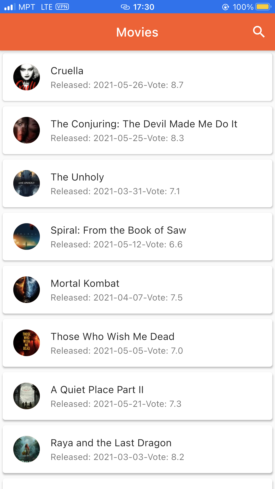
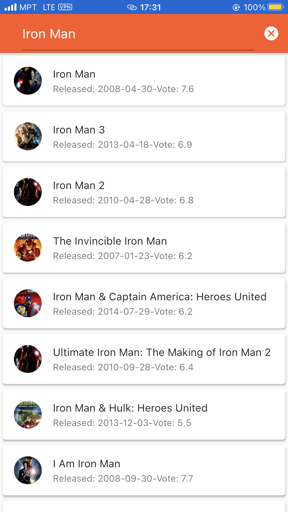

# flutter_movies

Movies App

## Getting Started

Retrieve Movies from Web Service API from themoviedb.

A few resources to get you started if this is your first Flutter project:

- [Lab: Write your first Flutter app](https://flutter.dev/docs/get-started/codelab)
- [Cookbook: Useful Flutter samples](https://flutter.dev/docs/cookbook)
